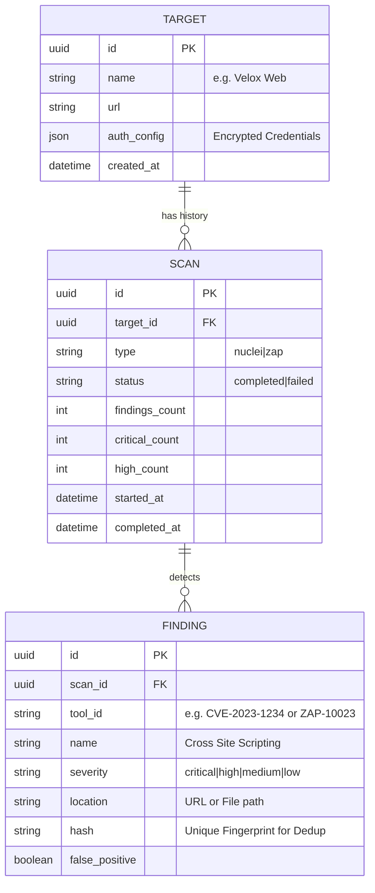

# Database & KPI Feasibility Report

**Date**: 2026-01-25
**Status**: DRAFT
**Context**: Phase 3 Foundation

## 1. Executive Summary
Velox Orchestra currently uses transient in-memory storage (`SCAN_DB`). To enable "Historical Analysis" and "KPI Tracking" (e.g., *Is Project X getting more secure?*), we **MUST** migrate to a persistent relational database.

**Recommendation**: Adopt **PostgreSQL** + **SQLAlchemy** (Async).
**Feasibility**: High. The data models are simple, and Docker composition makes adding Postgres trivial.

## 2. Data Requirements

### 2.1 The "Target" Entity
Currently, we only scan "URLs". To track KPIs, we need to group these URLs into persistent entities (e.g., "Projects" or "Targets").
*   **Target**: Represents a persistent asset (e.g., "Velox Knowledge Base").
*   **KPIs needed**:
    *   Last Scan Date.
    *   Current Risk Score.
    *   Open Vulnerability Count (Critical/High/Med).

### 2.2 The "Scan" History
We need to store every scan execution to calculate trends.
*   **Retention**: Infinite metadata, potentially truncated "details" after X months.
*   **KPIs needed**:
    *   Scan Duration (Performance).
    *   Success/Failure Rate (Reliability).

### 2.3 The "Finding" (Vulnerability)
To track "Fixed" vs "New" issues, we must store individual findings, structured and hashable (to identify duplicates).
*   **Deduplication**: Critical. If Scan A finds "XSS on /login", and Scan B finds it again, it's the *same* issue, not two.

## 3. Proposed Schema (ER Diagram)

## 4. KPI Definitions & SQL Feasibility

With the above schema, we can trivialy query:

| KPI | SQL Logic | Complexity |
| :--- | :--- | :--- |
| **Security Trend** | `SELECT date_trunc('day', started_at), avg(critical_count) FROM scans GROUP BY 1` | Low |
| **MTTR (Mean Time To Resolve)** | Requires tracking "First Seen" vs "Last Seen". (Advanced: requires `Vulnerability` lifecycle table). | High |
| **Scan Reliability** | `SELECT count(*) FROM scans WHERE status='failed' / total` | Low |
| **Most Vulnerable Targets** | `SELECT name, sum(critical_count) FROM targets JOIN scans...` | Low |

## 5. Implementation Strategy

1.  **Infrastructure**: Add `postgres` service to `docker-compose.yml`.
2.  **ORM**: Install `SQLAlchemy` (or `SQLModel`) + `alembic` (Migrations) in `orchestrator/requirements.txt`.
3.  **Migration**:
    *   Create `Target` CRUD API (`POST /targets`, `GET /targets/{id}/stats`).
    *   Update `POST /scans` to optionaly link to a `target_id`.
    *   Implement "Finding" ingestion that flattens ZAP/Nuclei JSON into rows.

## 6. Effort Estimate
*   **Design**: 2 hours
*   **Infra & Models**: 4 hours
*   **API Migration**: 6 hours
*   **Dashboard/KPI UI**: 8 hours (Frontend work)

**Total**: ~2-3 Days.
