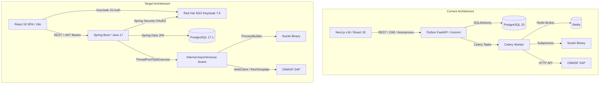

# Codebase Review and Stack Migration Strategy

**Author**: Antigravity (DevSecOps Specialist & Security Architect)  
**Date**: 2026-05-21  
**Status**: Proposal (Review Phase)  

---

## 1. Executive Summary

This document provides a comprehensive review of the current Velox codebase and outlines a migration strategy to implement the new technology stack defined in [stack.md](file:///c:/Users/Ayoub/Desktop/Projects/Velox/project-docs/stack.md). 

The target stack consists of:
*   **Web Frontend**: React JS 18.x
*   **Backend**: Spring Boot 3.4.x / 4.x (Java AdoptOpenJDK 17)
*   **Database**: PostgreSQL 17.1
*   **Authentication**: OAuth2 with Red Hat SSO (Keycloak) 7.6 (Active Directory integration via Employee ID)

Migrating to this stack requires a complete rewrite of the Python-based backend and orchestration services in Java, a downgrade/realignment of the frontend React version (moving from React 19/Next.js to a dedicated React 18 SPA or Next.js 14), and the integration of enterprise-grade SSO.

---

## 2. Current vs. Target Architecture

### Key Differences & Architectural Shifts
1.  **Backend Language Shift**: Transitioning from a Python FastAPI codebase (with Celery/Redis background queue) to a Spring Boot (Java 17) framework. 
2.  **Concurrency Model**: Replacing Celery/Redis with Spring Boot's internal asynchronous thread pools (`ThreadPoolTaskExecutor` with `@Async`), simplifying deployment by removing Redis, or keeping Redis if multi-node horizontal scaling is needed.
3.  **Frontend Framework Realignment**: Downgrading React from 19.x to 18.x. Transitioning from Next.js (which relies on Node.js filesystem access to read the markdown KB files) to a React 18 SPA, moving markdown parsing and reading to the Spring Boot backend.
4.  **SSO Authentication**: Securing the entire ecosystem using Red Hat SSO (Keycloak) 7.6.

---

## 3. Component-by-Component Migration Plan

### 3.1 Web Frontend: React JS (Version: 18.x)
*   **Current State**: Next.js (configured with React 19.2.3 in `package.json`).
*   **Migration Challenge**: Next.js 15+ is built for React 19. If we must use React 18, we have two options:
    *   *Option A (Recommended)*: Transition to a **Vite + React 18 SPA**. This removes the Node.js Server layer, results in faster load times, and simplifies Keycloak JS client integration. Since filesystem access is lost, the KB loading logic (`src/lib/docs.ts`) will be migrated to the Spring Boot backend.
    *   *Option B*: Downgrade Next.js to **Next.js 14.x** (which natively supports React 18) and keep the file-routing structure.
*   **Authentication Integration**:
    *   Install the Keycloak JS adapter (`keycloak-js@22.0.0` or version matching Keycloak 7.6, which is typically v18 or v15).
    *   Implement an authentication provider wrapper (`KeycloakProvider`) to initialize authentication before mounting the React tree.
    *   Inject the JWT access token in the `Authorization` header (`Bearer <token>`) for all calls in `src/lib/api.ts`.
*   **Styling & UI**:
    *   Retain the custom theme, dark/light mode toggle (`ThemeContext`), and bilingual translations (`LanguageContext`).
    *   Keep Tailwind CSS v4 since it supports React 18.

### 3.2 Backend: Spring Boot (Java AdoptOpenJDK 17)
*   **Current State**: Python FastAPI with Celery and Redis.
*   **Migration Strategy**:
    *   Bootstrap a Spring Boot 3.4.x application using AdoptOpenJDK 17.
    *   **Spring Security & OAuth2**:
        *   Configure Spring Security as an **OAuth2 Resource Server** (`spring-boot-starter-oauth2-resource-server`).
        *   Point JWT validation to the Keycloak 7.6 realm issuer URI.
        *   Validate incoming claims, check token expiry, and extract roles to enforce access controls.
    *   **REST Controllers**:
        *   `ScanController`: Manage scan execution, retrieval, and status sync.
        *   `TargetController`: CRUD endpoints for targets.
        *   `StatsController`: Metrics and trends for the KPI dashboard.
        *   `KbController`: Expose KB articles (markdown parsed to HTML using Flexmark or Commonmark-Java library).
        *   `ChatController`: Proxy requests to OpenRouter, implement regex-based DLP rules, and write audit logs.
    *   **Asynchronous Scan Orchestration**:
        *   Configure a thread pool task executor.
        *   Implement `runScan` method annotated with `@Async`.
        *   **Nuclei Wrapper**:
            *   Translate python subprocess logic to `java.lang.ProcessBuilder`.
            *   Safely handle command-line injection (use raw argument arrays, do not use shell execution).
            *   Stream standard output, parse JSON lines using Jackson ObjectMapper, and insert into the database.
        *   **ZAP Wrapper**:
            *   Translate python requests logic to Spring `WebClient` or `RestTemplate`.
            *   Implement Replacer Rule injections to inject Auth headers.
            *   Poll spidering and active scan status endpoints until completion.
    *   **Excel Report Generation**:
        *   Translate `openpyxl` logic into **Apache POI**.
        *   Build the `Summary` sheet and `Findings` sheet.
        *   Apply color styling to cells (red for critical, yellow for high) using Apache POI styles.
    *   **Database (Spring Data JPA)**:
        *   Implement `TargetEntity`, `ScanEntity`, and `FindingEntity`.
        *   Map relationships using `@OneToMany(mappedBy = "target")` and `@ManyToOne`.
        *   Configure PostgreSQL connection strings using HikariCP.

### 3.3 Database: PostgreSQL (Version: 17.1)
*   **Current State**: PostgreSQL 15.
*   **Migration Strategy**:
    *   Update `docker-compose.yml` db service image to `postgres:17.1-alpine`.
    *   Update the `db-backup` container image to `postgres:17.1-alpine` to ensure `pg_dump` utility compatibility.
    *   Map new volume paths to avoid compatibility issues with PG15 data directories.

### 3.4 Authentication: OAuth2 with Red Hat SSO (Keycloak 7.6)
*   **Current State**: Non-existent (uses simple client-side session ID).
*   **Migration Strategy**:
    *   Add a `keycloak` service in `docker-compose.yml` running Keycloak 18.0.x (RH SSO 7.6 equivalent).
    *   Set up a realm `velox` with two clients:
        *   `velox-frontend`: Public client (Flow: Authorization Code with PKCE).
        *   `velox-backend`: Confidential client/Resource server.
    *   Enable User Federation mapping to LDAP/Active Directory to satisfy corporate requirements (allowing employees to authenticate using Employee ID/Password).

---

## 4. Threat Modeling & Security Review

From a security perspective, this migration dramatically improves the project's security posture by replacing basic local session IDs with central Keycloak SSO, but introduces new attack vectors:

### Threat Matrix

| Threat ID | Threat Description | Severity | Mitigation Strategy |
| :--- | :--- | :--- | :--- |
| **T-001** | **Token Leakage in Logs** Keycloak tokens or authorization headers printed in backend application logs. | **High** | Implement strict logging interceptors to filter out `Authorization` headers. Never log token strings or raw headers. |
| **T-002** | **OS Command Injection (Nuclei)** Manipulated target URLs or custom scan configurations injected into `ProcessBuilder`. | **Critical** | Validate target URLs using strict regex. Pass arguments as distinct items in `ProcessBuilder(String... args)` rather than concatenating a single command string. |
| **T-003** | **SSO Session Hijacking** Stealing frontend tokens stored in browser memory/localstorage. | **High** | Configure short JWT lifespan (e.g. 5 minutes) and implement Keycloak silent refresh. Serve UI assets with strict CSP. |
| **T-004** | **Unauthenticated Scans** Triggering DAST scans without authorization. | **Critical** | Protect `/api/v1/scans` endpoint with Spring Security `hasRole('VELOX_SCANNER')` verification. |

---

## 5. Next Steps

To begin building this on a separate branch, we recommend:
1.  **Branch Setup**: Create a new branch `feature/spring-boot-keycloak-migration`.
2.  **Environment Setup**: Prepare the local docker environment with Keycloak 7.6 and PostgreSQL 17.1.
3.  **Backend Skeleton**: Bootstrap Spring Boot with Spring Security, Spring Data JPA, and Lombok.
4.  **Frontend Transition**: Re-initialize the frontend application as a Vite SPA (React 18), importing existing components and redirecting filesystem KB operations to the Spring Boot REST API.
5.  **Validation**: Test Keycloak SSO flow, run DAST scans via Spring `@Async` jobs, and verify report formatting.
