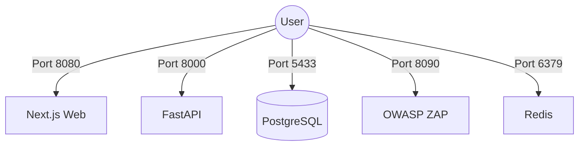

# Technical Design: Backend Isolation & Port Minimization

## 1. Feature Overview
The goal of this architectural change is to enforce strict network isolation for all internal backend services. Currently, Velox exposes multiple container ports to the host interface (`8000` for API, `5433` for DB, `6379` for Redis, `8090` for ZAP). To minimize the attack surface, we will isolate these services so that communication happens **strictly within the Docker bridge network**. Only the `web` service (Frontend UI) will remain accessible from outside the container environment on Port `8080`.

## 2. Technical Architecture

### 2.1 Current State (Over-exposed)


### 2.2 Target State (Isolated Backend)
```mermaid
graph TD;
    User((User)) -->|Port 8080| Web[Next.js Web];
    
    subgraph Internal Docker Network (Restricted to Container Env)
        Web -->|Internal DNS mapping| API[FastAPI:8000];
        API --> DB[(PostgreSQL:5432)];
        API --> Redis[Redis:6379];
        API --> ZAP[OWASP ZAP:8090];
        Worker[Celery Worker] -.-> DB;
        Worker -.-> Redis;
        Beat[Celery Beat] -.-> DB;
        Beat -.-> Redis;
    end
```

## 3. Implementation Details

We will rely on Docker Compose's default custom bridge network behavior. Services defined in a single `docker-compose.yml` file implicitly join a shared network that allows them to communicate using their service names (e.g., `http://api:8000`).

By explicitly removing the `ports:` definition from a service, Docker will **no longer route host traffic into that container**. The containers will continue seamlessly communicating via the internal Docker bridge.

### 3.1 Next.js API Proxy (`web` container)
The frontend UI does not query the API or ZAP directly from the client's browser. Instead, `next.config.ts` handles API requests using a `rewrites` function:
```javascript
  async rewrites() {
    return [
      {
        source: '/api/:path*',
        destination: 'http://api:8000/api/:path*',
      },
    ];
  }
```
Because the Next.js server runs inside the `web` container (which shares the internal network with the `api` container), it easily resolves `http://api:8000` internally, hiding the backend endpoints from the user's browser payload entirely.

## 4. Required Code Changes

### `docker-compose.yml`
We must surgically delete the `ports:` array from the following services:
- **`api`**: Remove `ports: - "8000:8000"`
- **`redis`**: Remove `ports: - "6379:6379"`
- **`db`**: Remove `ports: - "5433:5432"`
- **`zap`**: Remove `ports: - "8090:8090"`

*Note: The `web` service will retain `ports: - "8080:8080"` to remain highly accessible.*

### `next.config.ts`
We will clean up the Content Security Policy (CSP). Currently, it explicitly allows `http://localhost:8090` (ZAP port):
```javascript
value: "default-src 'self'; connect-src 'self' http://localhost:8090 ws://localhost:8080; ..."
```
We will remove `http://localhost:8090` since the browser will no longer interact with it.

### `orchestrator/main.py`
To ensure the backend API documentation (Swagger UI/Redoc) remains accessible to developers after Port `8000` is closed, the FastAPI endpoints are shifted to sit behind the Next.js `/api/v1` rewriting proxy:
```python
    docs_url=f"{settings.API_V1_STR}/docs",
    redoc_url=f"{settings.API_V1_STR}/redoc"
```
This enables zero-config developer access via `http://localhost:8080/api/v1/docs`.

### Operational Scripts & Documentation
Through further analysis of the codebase, several external references to Port 8000 were identified and must be pruned to avoid broken configurations or misleading documentation:
- **`scripts/quick_config_rhel9.sh`**: Currently executes `firewall-cmd --permanent --add-port=8000/tcp`. This must be removed, as the API no longer needs host-level ingress.
- **`docs/INSTALL_RHEL9.md`**: Contains instructions to open Port 8000.
- **`README.md`**: May contain references to accessing the API at `localhost:8000`.

## 5. Security & QA Verification
-   **Security**: Verify via `docker ps` that only `0.0.0.0:8080->8080/tcp` exists under the "PORTS" column, confirming that the other applications only show their exposed application ports un-bound to host IPs.
-   **QA Status Checks**: Ensure that navigating to the `/dast` UI still loads scan statistics, confirming that the Web container successfully proxies API queries locally.
