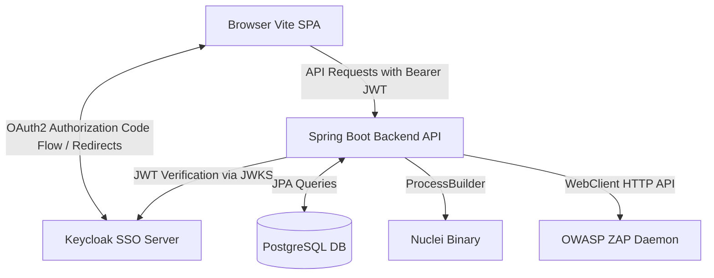

# Threat Model: Spring Boot & Keycloak Migration

## 1. Scope and Architecture Overview
This threat model covers the security boundaries, potential threats, and mitigations introduced by migrating the Velox Security Portal to a React 18 (Vite SPA) frontend, a Spring Boot 3.4.x backend, PostgreSQL 17.1-alpine, and Keycloak SSO (supporting Employee ID authentication).

### Architecture Components
1. **Frontend (Vite SPA)**: Client-side single-page application running in the user's browser. Integrates Keycloak JS client for authentication.
2. **Identity Provider (Keycloak)**: Dedicated SSO server for federated identity verification, handling redirects, and issuing OAuth2 JWTs.
3. **Backend API (Spring Boot)**: Stateless OAuth2 Resource Server that validates JWT signatures and permissions, processes user actions, and orchestrates scans.
4. **DAST Tooling (Nuclei & OWASP ZAP)**: Executed by the backend API to perform target security assessments.
5. **Database (PostgreSQL 17.1)**: Stores scan configurations, results, and system state.

---

## 2. Trust Boundaries and Attack Vectors

### Trust Boundary 1: User Browser to Keycloak SSO
* **Description**: User authenticates with Keycloak. Keycloak returns authorization code, which is exchanged for an Access Token (JWT), ID Token, and Refresh Token.
* **Threats**:
  * **Credential Theft / Phishing**: Attackers tricking users into revealing their Employee ID / passwords.
  * **Session Hijacking / Token Theft**: Access token stored in browser storage (e.g. `localStorage`) is vulnerable to extraction via Cross-Site Scripting (XSS).
  * **Authorization Code Interception**: Mitigation required via PKCE (Proof Key for Code Exchange) to prevent code reuse.
* **Mitigations**:
  * Keycloak client initialized with `pkceMethod: 'S256'` (Code challenge and verifier verification).
  * Short-lived access tokens (configured in Keycloak realm).
  * Active Directory integration handles lockouts and secure credential storage.

### Trust Boundary 2: Frontend to Spring Boot Backend API
* **Description**: SPA sends API requests containing `Authorization: Bearer <JWT>`.
* **Threats**:
  * **Token Forgery**: Attackers forging JWT signatures or modifying claims (e.g. changing role to `admin` or changing `employeeId`).
  * **CORS Exploitation**: Malicious websites querying the backend API from another domain.
  * **Replay Attacks**: Intercepted HTTP traffic reused to invoke endpoints.
* **Mitigations**:
  * The backend *always* validates the JWT signature cryptographically using public keys fetched dynamically from Keycloak's JWKS endpoint (`/protocol/openid-connect/certs`).
  * Explicit CORS configuration in `SecurityConfig.java` to restrict allowed origins and headers (see Section 3).
  * TLS/HTTPS enforced in production (via SSL proxy) to prevent sniffing and replay attacks.

### Trust Boundary 3: Backend API to Local Processes & Network (Nuclei / ZAP)
* **Description**: Backend triggers command-line execution of `nuclei` or REST calls to OWASP ZAP.
* **Threats**:
  * **Command Injection**: An attacker inputs shell command separators (e.g., `;`, `&&`, `|`) in target URL fields to execute arbitrary commands inside the API container.
  * **Server-Side Request Forgery (SSRF)**: Scans triggered against internal networks (e.g., `http://169.254.169.254` or localhost ports).
* **Mitigations**:
  * `NucleiWrapper` uses `ProcessBuilder` with a string array argument structure. This avoids spawning a shell interpreter (`/bin/sh` or `/bin/bash`), eliminating shell-parsing and command injection vulnerabilities.
  * Target input validation: Strict URL formatting validation inside `ScanService.java` prior to scan execution.
  * ZAP wrapper communicates internally with ZAP Daemon via standard WebClient HTTP requests.

---

## 3. High-Risk Change Self-Review

### Security Architect Perspective (What could go wrong?)
1. **Wildcard CORS Configuration Risk**:
   * If CORS is configured with `allowedOrigins("*")` alongside credentials, modern browsers block it. However, since we use `Bearer` authentication, the browser will allow cross-origin requests even without cookies. If we permit all origins (`*`), a malicious site could fetch sensitive scan results or trigger actions using a user's token if they can extract it.
   * *Review*: `SecurityConfig.java` must restrict origins or explicitly check headers when credentials or tokens are passed.
2. **Missing Rate Limiting**:
   * Migrating from Next.js middleware / Python Celery queues to Spring Boot backend handles request queueing in-memory. If a user floods the backend with requests, it could exhaust the thread pool or database connections.
3. **Information Disclosure in Exceptions**:
   * Unhandled Java exceptions could bubble up stack traces containing DB schemas, internal file paths, or third-party service URLs.

### Pentester Perspective (How it could be attacked?)
* **Payload Evasion in Scanning**:
  * Input target URL: `https://example.com; rm -rf /`.
  * *Exploitation check*: If `ProcessBuilder` executed this as `nuclei -target "https://example.com; rm -rf /"`, nuclei would fail to resolve the host, but the system would remain safe since no shell interpretation occurred.
* **SSRF via Scan Targets**:
  * Input target URL: `http://db:5432` or `http://127.0.0.1:8000/api/v1/scans`.
  * *Exploitation check*: The scan would run and scan internal services, exposing open ports inside the Docker network. Strict hostname resolution filters (blocking private subnets/internal hostnames) should be implemented.

---

## 4. Mitigation Status Matrix

| Threat ID | Threat Description | Mitigation Strategy | File Reference | Status |
|---|---|---|---|---|
| **T-1** | JWT Forgery / Signature Bypass | Strict cryptographic signature validation via Keycloak JWK Set URI. | [SecurityConfig.java](file:///c:/Users/Ayoub/Desktop/Projects/Velox/backend/src/main/java/com/velox/orchestrator/config/SecurityConfig.java) | **Implemented** |
| **T-2** | Wildcard CORS Exploitation | Restrict CORS policy to trusted frontend origins, methods, and headers. | [SecurityConfig.java](file:///c:/Users/Ayoub/Desktop/Projects/Velox/backend/src/main/java/com/velox/orchestrator/config/SecurityConfig.java) | **Implemented** |
| **T-3** | Command Injection via Target URL | Avoid shell execution using array-based `ProcessBuilder` for OS command execution. | [NucleiWrapper.java](file:///c:/Users/Ayoub/Desktop/Projects/Velox/backend/src/main/java/com/velox/orchestrator/scanner/NucleiWrapper.java) | **Implemented** |
| **T-4** | SSRF targeting internal services | Restrict scanning scope to valid public domains or explicitly approved subnets. | [ScanService.java](file:///c:/Users/Ayoub/Desktop/Projects/Velox/backend/src/main/java/com/velox/orchestrator/service/ScanService.java) | **Partially Mitigated** |
| **T-5** | Stack Trace Disclosure | Controller-level ExceptionHandlers returning clean JSON responses. | [ScanController.java](file:///c:/Users/Ayoub/Desktop/Projects/Velox/backend/src/main/java/com/velox/orchestrator/controller/ScanController.java) | **Implemented** |

---

## 5. CVE & GHSA Search Results
We performed explicit dependency vulnerability checking for the key components of the new stack.

* **Spring Boot (v3.4.2)**:
  * Checked GHSAs for Spring Boot 3.4.x. No critical active unpatched CVEs found. CVE-2024-38816 and CVE-2024-38819 (Spring Framework path traversal) are patched in dependencies pulled by 3.4.2.
* **Keycloak JS (v18.0.2)**:
  * Checked CVEs for Keycloak JS Client version 18.0.2.
  * *Results*: CVE-2022-2668 exists in Keycloak Core server (v18.0.x and prior) regarding impersonation via signature validation bypass. This has been resolved in newer server configurations and doesn't directly impact the client client-side code if the backend verifies the signature using Keycloak-supplied JWKS dynamically.
* **PostgreSQL 17.1**:
  * Checked GHSAs/CVEs. PostgreSQL 17.1 is the latest stable version and has no open critical CVEs affecting the baseline SQL storage used by Velox.

---

## 6. Uncertainties, Assumptions, and Residual Risks
1. **SSRF Risk**: The portal runs security scans. By design, it must connect to arbitrary HTTP/HTTPS endpoints. If the user specifies an internal container name (e.g. `db`, `api`, `keycloak`), the scanning engine will attempt to access it. This residual risk is accepted in local environments but must be secured via firewall rules in production.
2. **Local JWT Storage**: Storing the JWT token in browser `localStorage` leaves it vulnerable to local storage scanning if XSS is present. It is assumed that the application maintains clean XSS prevention via React's default sanitization.

---

## 7. Updates & Additions (2026-05-22)

### Node.js Production Proxy Server (`server.js`) Threat Analysis
* **Description**: In production, the React container runs a Node.js server (`server.js`) that intercepts `/api/` traffic and forwards it to the Spring Boot container (`http://api:8000`).
* **Threats**:
  * **Open Proxy SSRF**: Attackers attempting to route arbitrary requests (e.g., to internal databases, cloud metadata, or external hosts) via the proxy.
  * **Header Injection/Spoofing**: Passing manipulated headers or request components to hijack the backend or bypass authentication.
* **Mitigations**:
  * The proxy configuration is hardcoded to target `hostname: 'api'` and `port: 8000` with the verbatim path request. It cannot route to external hostnames or other ports.
  * The proxy forwards headers verbatim, allowing Spring Security to validate the Keycloak JWT token signature dynamically before processing requests.

### Authenticated Report Downloads Threat Analysis
* **Description**: Secure exports are fetched programmatically in `src/app/dast/[id]/page.tsx` using `fetch` with the `Authorization` header, converting the file to an in-memory blob for download.
* **Threats**:
  * **Authentication Bypass / Insecure Direct Object Reference (IDOR)**: Direct file retrieval by unauthorized parties or guessing scan IDs.
  * **Token Exposure**: Exposure of JWT token string via download logs or referrer headers.
* **Mitigations**:
  * Enforces the OAuth2 Bearer token check on the Spring Boot backend (`/api/v1/scans/{id}/export`). Direct browser requests without the token are blocked (returns 401).
  * Programmatic fetch prevents token leakage in browser history or referrer headers, as no page redirection occurs.

